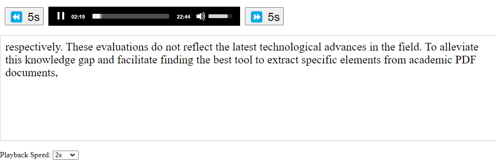

# Rehearser

Rehearser is an application for aiding in the reading of research papers.

(Image includes text from the "Demo Paper" [1])

## Usage

To use the application, the only requirement is [Docker](https://docs.docker.com/engine/install/) and [Docker Compose](https://docs.docker.com/compose/install/).

To run the server, execute the command `docker-compose up -d` in the root directory.

Once the server is running, you can navigate the application by going to `localhost:8000`. **Note, the applicaiton needs ports `8000` (used by `http-server`) and `5000` (used by `flask`). If they are used elsewhere, the application will not run.**

## Current Features

- Scrape a research paper to extract the narrational text.
- Convert scraped text to audio with segmented text-audio pairs for the original text.
- Provide a minimalistic front end for uploading documents and downloading text, and viewing the text-aligned audio with minimal playback controls.

## Technical Deatils

The application uses a few key components:

- [GROBID](https://grobid.readthedocs.io/en/latest/Introduction/) - The current library for parsing research papers. Docker Compose starts a GROBID docker image which [PDFs are sent to for extraction into XML.](app/extraction.py)
- [BeautifulSoup](https://pypi.org/project/beautifulsoup4/) - Used for [parsing the XML generated by GROBID](app/extraction.py) to find the parts of the research paper which are most relevant.
- [ESPNet](https://github.com/espnet/espnet) - Framework used for executing TTS functionality in python, [currently used to convert text chunks into audio files.](app/generation.py)
- [ljspeech_fastspeech2](https://huggingface.co/espnet/kan-bayashi_ljspeech_fastspeech2) - A FastSpeech2 model trained on the ljspeech dataset, the model [used for speech conversion.](app/generation.py)
- [PyTorch](https://pytorch.org/) - Machine learning framework responsible for [running the ESPNet models.](app/generation.py)
- [nltk](https://www.nltk.org/) - Natural language processing framework necessary for [grapheme to phoneme conversion in TTS.](app/generation.py)
- [Flask](https://flask.palletsprojects.com/en/stable/) - API Framework used to [host endpoints in python.](app/app.py)
- [SQLite3](https://www.sqlite.org/) - Lightweight database used to [store meta information and proessing status on uploaded papers.](app/app.py)
- [Celery](https://github.com/celery/celery) - Asynchronous task queue that is used to [queue paper processing requests](app/app.py) and [run them asyncronously.](app/celery_worker.py)
- [Redis](https://redis.io/) - In memory data store that is used to [store tasks for Celery workers.](app/celery_worker.py)
- [http-server](https://www.npmjs.com/package/http-server) - Static HTTP server used for [serving frontend applicaiton.](frontend/index.html)

## Disclaimer

This tool is still in early iterations. Please exercise caution with use.

1. The parsing may end up missing text (eg, a few lines at the top of a page) or adding undesired text (eg, such as the contents of a figure).

2. Citations are currently missing from the extracted text and audio.

## Citation

The "demo paper" used in this project is:

[1] Meuschke, Norman, et al. "A benchmark of pdf information extraction tools using a multi-task and multi-domain evaluation framework for academic documents." International Conference on Information. Cham: Springer Nature Switzerland, 2023.
